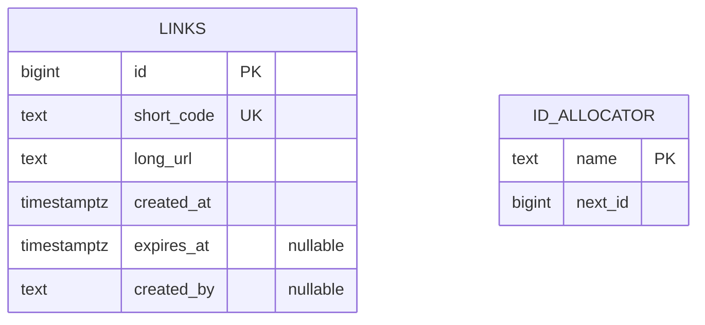
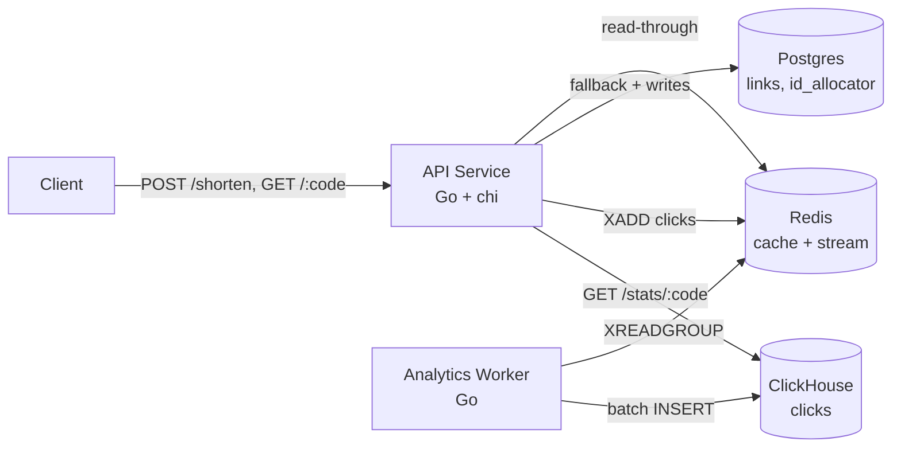
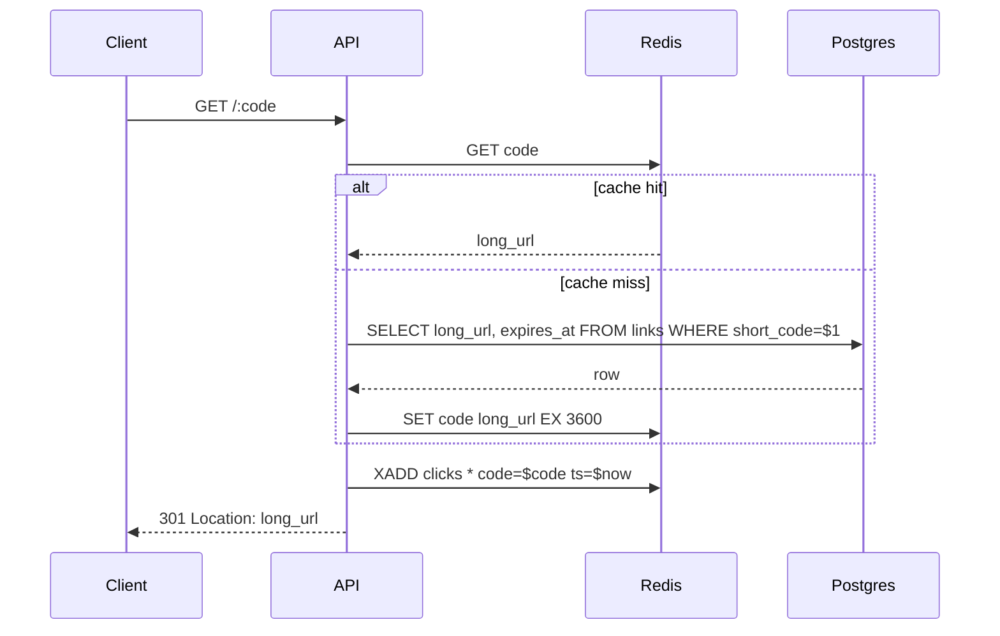
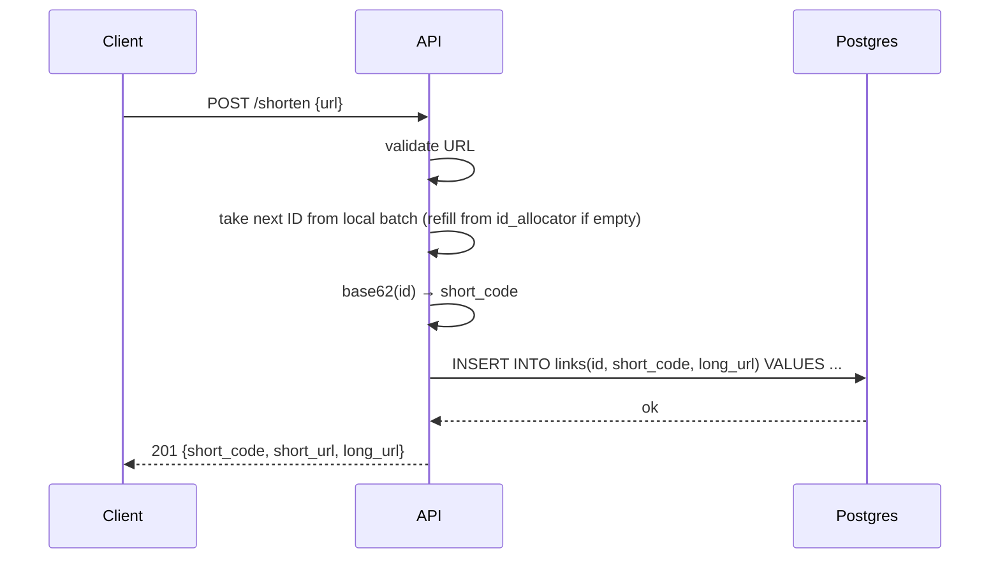

# url-shortener

> A bit.ly-style URL shortener: take a long URL, return a short code that redirects to it. First subproject in [sysdesign-lab](../../brain/projects/research/sysdesign-lab/status.md).

**Language/stack:** Go 1.22 (stdlib net/http + chi, pgx, go-redis, clickhouse-go, zerolog), Postgres 16, Redis 7, ClickHouse
**Category:** interview-classic
**Status:** building — redirect path working end-to-end; analytics pipeline pending
**Repo:** https://github.com/mhockenbury/url-shortener (public; matt pushes manually)

---

## 1. Requirements

### Functional
- Shorten a long URL and return a short code (`POST /shorten`)
- Redirect a short code to its long URL (`GET /:code` → 301)
- Support custom aliases (`POST /shorten` with `alias` field)
- Support optional expiry (expired codes return 410 Gone)
- Track click counts per short code, exposed via `GET /stats/:code`

### Non-functional
- **Read-heavy:** 10:1 read:write ratio (redirects >> creations)
- **Redirect latency:** p99 < 50ms for cache hits, < 150ms for cache misses
- **Availability:** single-region, best-effort; no HA story for the lab. *If this were production:* 99.9% monthly on the redirect path; best-effort on creation and stats.
- **Durability:** links and their mappings must not be lost; analytics counts are best-effort (async, at-least-once, eventual)
- **Consistency:** new short codes immediately readable (read-your-writes); analytics counts lag by seconds, not hours

### Out of scope
- Authentication / accounts (creator tracked as nullable field; no login)
- Abuse detection / spam filtering
- Multi-region, HA, failover
- Kubernetes, cloud deploy
- Anything client-side (no web UI beyond a trivial static page if time permits)

## 2. Capacity Estimates
<!-- Starter numbers — adjust if actual usage diverges. -->

- **Total links stored:** 100M
- **Read QPS:** 1000 peak, 200 avg (redirects)
- **Write QPS:** 100 peak, 20 avg (creations)
- **Analytics events:** ~1000/s peak, same as redirects. Stored raw in ClickHouse.
- **Storage per link (Postgres):** ~500 bytes (long URL average 200 chars + metadata) → ~50 GB over 100M links
- **Storage per click event (ClickHouse, uncompressed):** ~80 bytes raw; ~10–15 bytes compressed with ClickHouse's LZ4 + dictionary encoding on `LowCardinality` columns. At 1000 events/s sustained, ~1 GB/day compressed
- **Retention plan:** keep raw events for 90 days; use TTL clauses on the MergeTree. If needed later, add a materialized view into a daily-rollup table for long-range queries
- **Cache working set:** assume 10% of reads hit 1% of codes (hot set). 1M hot codes × 500 bytes = 500 MB Redis
- **ID space:** base62 at length 7 = 62^7 ≈ 3.5T — plenty of headroom for 100M links with room for custom aliases

## 3. API

### Endpoints

| Method | Path | Purpose | Auth |
|--------|------|---------|------|
| POST | `/shorten` | Create a short code for a URL | none |
| GET | `/:code` | Redirect to long URL | none |
| GET | `/stats/:code` | Return click count + recent hourly buckets | none |
| GET | `/healthz` | Liveness + DB/Redis reachability | none |

### Example request/response

```http
POST /shorten HTTP/1.1
Content-Type: application/json

{"url": "https://example.com/some/long/path?with=query", "alias": null, "expires_at": null}
```

```http
HTTP/1.1 201 Created
Content-Type: application/json

{"short_code": "aB3cD4e", "short_url": "http://localhost:8080/aB3cD4e", "long_url": "https://example.com/some/long/path?with=query"}
```

```http
GET /aB3cD4e HTTP/1.1
```
```http
HTTP/1.1 301 Moved Permanently
Location: https://example.com/some/long/path?with=query
```

## 4. Data Model

The data lives in **two stores with different shapes**: Postgres for the authoritative link data (transactional, small, consistency-sensitive) and ClickHouse for click events (append-heavy, columnar, aggregation-friendly).

### Postgres (source of truth for links)



- `links.short_code` UNIQUE btree — primary redirect lookup
- `links.id` PK btree
- `links.expires_at` partial index WHERE NOT NULL — cleanup job
- `id_allocator` is a single-row table per allocator name (default: `"links"`), updated with `UPDATE ... RETURNING` to hand out ID ranges to API instances (see Tradeoffs §2)
- `short_code` is stored explicitly rather than derived on read, because custom aliases share the namespace with counter-allocated codes

### ClickHouse (raw click events)

```sql
CREATE TABLE clicks (
    short_code  LowCardinality(String),
    ts          DateTime64(3),
    referrer    String,
    user_agent  String
) ENGINE = MergeTree
ORDER BY (short_code, ts)
TTL toDateTime(ts) + INTERVAL 90 DAY;
```

- `ORDER BY (short_code, ts)` co-locates events for the same code on disk — `GET /stats/:code` becomes a tight range scan
- `LowCardinality(String)` on `short_code` uses dictionary encoding; effective because codes repeat across rows
- No UPDATE/DELETE. At-least-once delivery from Redis Stream means occasional dupes; we accept small overcount rather than chase exact-once
- Extra dimensions (`referrer`, `user_agent`) are captured now so future stats queries don't require a migration — columnar storage makes unused columns nearly free

## 5. Architecture



### Component responsibilities
- **API Service:** HTTP handlers, URL validation, ID allocation (batched from `id_allocator`), base62 encoding, cache read-through, event emission. Stats endpoint queries ClickHouse. Stateless, horizontally scalable.
- **Redis:** two roles. (1) Read-through cache for `short_code → long_url`, TTL 1h. (2) Redis Stream `clicks` for analytics events.
- **Postgres:** source of truth for `links` and `id_allocator`.
- **ClickHouse:** append-only store for raw click events. Queried directly for stats; aggregation happens at read time.
- **Analytics Worker:** consumer-group reader on `clicks`, batches events (every 1s or 1000 events, whichever first), inserts raw rows into ClickHouse. No aggregation.

### Key request flow — redirect (hot path)



### Key request flow — shorten



## 6. Tradeoffs & Decisions

### Decision: ID generation — counter + base62 (with batched allocation)
- **Chose:** Monotonic bigint counter, encoded to base62. API instances reserve ID ranges (e.g., 1000 at a time) from `id_allocator` table, hand out from local range.
- **Rejected:**
  - *Hash-based (MD5 prefix + base62)*: deterministic but forces collision handling on the hot write path; same URL always maps to same code (sometimes desired, sometimes not)
  - *Random + collision check*: simple but adds a DB round-trip per write to check uniqueness; wastes short-code space
  - *Snowflake-style IDs*: overkill for single-region lab; fine if multi-region were on the table
- **Why:** Shortest codes for given ID count, simple to reason about, and the batch-allocation optimization is the exact interview conversation worth having. Easy to benchmark non-batched vs. batched to quantify contention.
- **When this would change:** Multi-region deployment (→ Snowflake or similar), or strict requirement that same URL always maps to same code (→ hash-based).

### Decision: Postgres + Redis cache from day one
- **Chose:** Read-through cache with 1h TTL on `short_code → long_url`. Postgres is source of truth.
- **Rejected:**
  - *Postgres-only*: simpler, but misses the read-heavy access pattern this system is defined by
  - *Redis-only*: loses durability; recovery story is unacceptable even for a lab
- **Why:** Matches real-world access pattern; gives us cache invalidation questions to answer; enables hot-path p99 < 50ms target.
- **When this would change:** If benchmarks showed Postgres alone handling target QPS with acceptable latency (it won't at 1000 RPS with network hops).

### Decision: Async analytics via Redis Stream
- **Chose:** Redirect handler publishes to Redis Stream `clicks`; separate worker consumes and batch-inserts into ClickHouse.
- **Rejected:**
  - *Synchronous counter update*: couples redirect latency to a write transaction; unacceptable for hot path
  - *Kafka*: correct for production scale, overkill for local lab (and complicates docker-compose)
  - *In-process channel + single writer*: works for single API instance, breaks on horizontal scale
- **Why:** Decouples hot path from bookkeeping; Redis Streams give us consumer groups and replay; fits local-only infra rule.
- **When this would change:** Cross-region or >10k events/s → Kafka; strict exactly-once → different architecture entirely.

### Decision: Raw events in ClickHouse, not aggregates in Postgres
- **Chose:** Store every click event raw in ClickHouse (`MergeTree` ordered by `(short_code, ts)`); aggregate at query time.
- **Rejected:**
  - *Aggregates in Postgres (`click_stats` hourly buckets)*: simpler, one fewer service — but discards dimensions (referrer, user agent, exact timestamp) that can't be recovered; Postgres is the wrong shape for append-heavy time-series at scale
  - *Raw events in Postgres*: keeps dimensions but row-store + B-tree is wrong for the workload; storage and query costs grow badly
  - *Redis-only counters*: violates the durability requirement for analytics visibility past TTL
  - *Kafka + Druid / TimescaleDB*: more correct at scale, but more infra than the lab justifies
- **Why:** Columnar + dictionary-encoded storage is the right shape; `LowCardinality(String)` + `MergeTree` compresses click rows to ~10–15 bytes; aggregation queries on a primary-key range are fast; keeps all dimensions for future stats features. Deliberately chosen to exercise a real columnar store — this is part of the lab's educational point.
- **When this would change:** If write volume exceeded ClickHouse's comfortable ingest (>100k/s) we'd add Kafka in front. If we ever needed sub-second latency on `GET /stats/:code` across billions of events, we'd add a materialized view doing hourly pre-aggregation — same schema, incremental cost.

### Decision: Custom aliases share the same `short_code` namespace as counter-allocated codes
- **Chose:** Single UNIQUE index on `short_code`. Custom aliases inserted with `id = NULL` or a reserved ID range; counter-allocated codes skip reserved IDs.
- **Rejected:**
  - *Separate table for aliases*: forces union on every lookup; redirect path gets slower or more complex
  - *Prefixing aliases with a sentinel char*: leaks implementation detail into the short URL
- **Why:** Single lookup path, single index, clean API. Collision between alias and counter-allocated code is resolved at write time.
- **When this would change:** If alias volume dwarfs counter volume (doesn't happen in practice).

## 7. Bottlenecks & Scaling

- **Current bottleneck at target load:** redirect path is cache-dominated, so Redis throughput is the first ceiling; at 1000 RPS a single Redis is fine
- **First scaling move:** add Redis replica for read scaling if cache QPS grows past single-instance limit
- **Second move:** partition `links` by `short_code` hash if Postgres write throughput saturates
- **What breaks first under 10x load:** `id_allocator` row contention — batch size becomes critical. Mitigation: larger batch, or multiple allocator rows sharded by instance
- **Analytics scaling:** Redis Stream can be partitioned with multiple streams keyed by `hash(short_code) % N`; worker count scales with stream count

## 8. Failure Modes

| Failure | Detection | Recovery |
|---------|-----------|----------|
| Redis down | health check fails; API errors on cache ops | fall back to Postgres-only reads (degraded p99); events buffered in-memory with bounded queue, dropped if worker backs up |
| Postgres down | health check fails | API returns 503 on writes; reads continue from cache for TTL window |
| Worker lagging | stream length > threshold | scale out worker consumers in the same consumer group |
| Worker crashes mid-batch | pending entries in Redis consumer group | `XPENDING` + `XCLAIM` on restart; at-least-once delivery means duplicate events possible — accepted as small overcount (stats are best-effort) rather than adding dedup machinery |
| ClickHouse down | insert errors; worker backs off | events accumulate in Redis Stream (bounded by `MAXLEN`); worker resumes on recovery; stats queries return 503 |
| ID allocator contention | elevated p99 on `POST /shorten` | increase batch size; shard allocator |

## 9. Running It Locally

```bash
cd ~/Projects/sysdesign-lab/url-shortener
docker-compose up -d postgres redis clickhouse
make migrate
make run-api      # terminal 1
make run-worker   # terminal 2

# create
curl -X POST localhost:8080/shorten -d '{"url":"https://example.com"}' -H 'content-type: application/json'
# redirect
curl -i localhost:8080/<code>
# stats
curl localhost:8080/stats/<code>

# poke ClickHouse directly
docker-compose exec clickhouse clickhouse-client --query "SELECT short_code, count() FROM clicks GROUP BY short_code ORDER BY count() DESC LIMIT 10"
```

## 10. Benchmarks
<!-- Filled in after implementation. Target scenarios:
  1. Redirect under cache-hit load (measure p50/p99/p999)
  2. Redirect under cache-miss cold start
  3. Shorten with batch size 1 vs 100 vs 1000 (quantify id_allocator contention)
  4. Analytics pipeline lag at 2x expected peak events/s -->

## 11. Retrospective
<!-- Filled in when the subproject is marked done. -->
