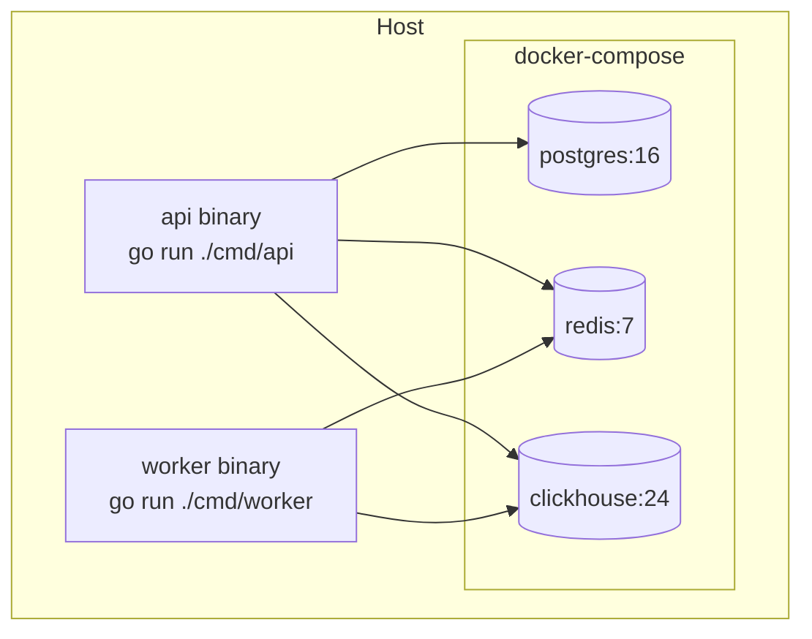

# Architecture — url-shortener

Deeper component breakdown. The README has the top-level view; this doc expands on each component.

## Components

### API service (`cmd/api`)
- Stateless HTTP server on `:8080`
- Routes via chi; handlers live in `internal/http`
- Holds a `shortener.Service` (domain) wired to Postgres + Redis adapters
- Graceful shutdown on SIGTERM: stop accepting new requests, drain in-flight, close DB/Redis pools

### Analytics worker (`cmd/worker`)
- Consumer-group reader on Redis Stream `clicks`
- Group name: `analytics`; consumer name: hostname + pid
- Batch policy: flush every 1s OR 1000 events, whichever comes first
- Per batch: single bulk `INSERT INTO clicks VALUES (...)` into ClickHouse — no aggregation, raw rows
- `XACK` after successful insert; unacked entries remain pending and are reclaimed via `XPENDING`/`XCLAIM` on restart
- Duplicate events (from at-least-once delivery) are accepted as small overcount — stats are best-effort

### Shortener domain (`internal/shortener`)
- `IDAllocator`: reserves ID ranges from Postgres, hands out sequentially. Thread-safe.
  - Batch refill: `UPDATE id_allocator SET next_id = next_id + $batch WHERE name=$1 RETURNING next_id - $batch` (returns start of reserved range)
- `Base62`: encode/decode bigint ↔ short_code
- `Service`: orchestrates Create/Lookup/Stats operations

### Storage adapters (`internal/storage`)
- `postgres`: pgx pool; prepared statements for hot queries on `links` and `id_allocator`
- `redis`: go-redis client; separate helpers for cache ops vs stream ops
- `clickhouse`: clickhouse-go v2 client; batch insert helper for the worker, query helpers for the stats endpoint

### Events (`internal/events`)
- Producer: wrapper around `XADD` with bounded local buffer (drop-on-full with metric)
- Consumer: pull loop with batch read, exposed as a channel or callback for the worker

## Request lifecycles

### POST /shorten
1. Decode + validate JSON (URL parseable, scheme http/https, length ≤ 2048)
2. If alias provided: insert with alias as short_code; 409 on conflict
3. Else: take next ID from allocator; encode to base62; insert
4. Return 201 with short_code + short_url

### GET /:code
1. Reject codes that don't match `^[0-9A-Za-z]{1,32}$`
2. Redis GET; on hit, skip step 3
3. Postgres SELECT; on miss, 404; on expired, 410
4. Redis SETEX with TTL 1h
5. Redis XADD to `clicks` with `{code, ts}` — best-effort, errors logged but not returned
6. 301 Location: long_url

### GET /stats/:code
1. ClickHouse query:
   ```sql
   SELECT toStartOfHour(ts) AS hour, count() AS clicks
   FROM clicks
   WHERE short_code = ? AND ts >= now() - INTERVAL 7 DAY
   GROUP BY hour
   ORDER BY hour
   ```
2. Return total (sum) and hourly series. Query is a tight primary-key range scan thanks to `ORDER BY (short_code, ts)`.

## Deployment topology (local)



API and worker run on the host during development for fast iteration; a future iteration may dockerize them once benchmarks begin.
